# Fred-LLM

**Solving Fredholm Integral Equations using Large Language Models**

This project provides tools for solving and approximating Fredholm integral equations of the second kind using LLMs. It supports both symbolic and approximate (series-based) solutions, with flexible prompting strategies and evaluation metrics.

## Equation Form

The general Fredholm integral equation of the second kind:

$$u(x) - \lambda \int_a^b K(x, t) u(t) \, dt = f(x)$$

where:
- $u(x)$ is the unknown function to solve for
- $K(x, t)$ is the kernel function
- $f(x)$ is the known right-hand side
- $\lambda$ is a parameter
- $[a, b]$ is the integration domain

## Features

- 🤖 **Multi-provider LLM support**: OpenAI API, local models (HuggingFace, vLLM)
- 📝 **Multiple prompting styles**: Basic, Chain-of-Thought, Few-Shot, Tool-Assisted
- 🔢 **Symbolic & numeric evaluation**: SymPy-based parsing and verification
- 📊 **Format conversion**: LaTeX, RPN, tokenized representations
- 📈 **Comprehensive metrics**: Symbolic equivalence, numeric accuracy, solution verification

## Pipeline Architecture

The project follows a modular 4-stage pipeline:

```mermaid
%%{init: {'theme': 'neutral', 'themeVariables': { 'fontSize': '14px'}}}%%
flowchart LR
 subgraph Dataset_Preparation["Module 1: Dataset Preparation"]
    direction TB
    DP1["Data Augmentation"]
    DP1a(["Add no-solution"])
    DP1b(["Add special function"])
    DP1c(["Generate numeric ground truth"])
    DP2["Format Conversion"]
    DP2a(["To LaTeX"])
    DP2b(["To RPN"])
    DP2c(["Tokenize for LLM"])
    DP1 --> DP1a & DP1b & DP1c
    DP1 --> DP2
    DP2 --> DP2a & DP2b & DP2c
  end

 subgraph Prompt_Engineering["Module 2: Prompt Engineering"]
    direction TB
    PR1["Prompt Design"]
    PR1a(["Direct prompts"])
    PR1b(["Chain of thought"])
    PR1c(["Approximation prompts"])
    PR2["Output Format"]
    PR2a(["Symbolic"])
    PR2b(["Series"])
    PR2c(["Code format"])
    PR1 --> PR1a & PR1b & PR1c
    PR1 --> PR2
    PR2 --> PR2a & PR2b & PR2c
  end

 subgraph LLM_Methods["Module 3: LLM Methods"]
    direction TB
    LLM1["Fine Tuning"]
    LLM1a(["Supervised pairs"])
    LLM1b(["Use Phi or T5"])
    LLM2["In Context Learning"]
    LLM2a(["Few-shot examples"])
    LLM2b(["Chain of thought prompts"])
    LLM3["Tool Use"]
    LLM3a(["Generate Python"])
    LLM3b(["Use symbolic tools"])
    LLM1 --> LLM1a & LLM1b
    LLM1 --> LLM2
    LLM2 --> LLM2a & LLM2b
    LLM2 --> LLM3
    LLM3 --> LLM3a & LLM3b
  end

 subgraph Evaluation["Module 4: Evaluation"]
    direction TB
    EV1["Symbolic Eval"]
    EV1a(["Exact match"])
    EV1b(["BLEU / TeX BLEU"])
    EV2["Numeric Eval"]
    EV2a(["MAE / MSE"])
    EV2b(["Test points"])
    EV3["Robustness"]
    EV3a(["Prompt variation"])
    EV3b(["Unseen function types"])
    EV1 --> EV1a & EV1b
    EV1 --> EV2
    EV2 --> EV2a & EV2b
    EV2 --> EV3
    EV3 --> EV3a & EV3b
  end

    Dataset_Preparation --> Prompt_Engineering
    Prompt_Engineering --> LLM_Methods
    LLM_Methods --> Evaluation

     DP1:::submod
     DP1a:::step
     DP1b:::step
     DP1c:::step
     DP2:::submod
     DP2a:::step
     DP2b:::step
     DP2c:::step
     PR1:::submod
     PR1a:::step
     PR1b:::step
     PR1c:::step
     PR2:::submod
     PR2a:::step
     PR2b:::step
     PR2c:::step
     LLM1:::submod
     LLM1a:::step
     LLM1b:::step
     LLM2:::submod
     LLM2a:::step
     LLM2b:::step
     LLM3:::submod
     LLM3a:::step
     LLM3b:::step
     EV1:::submod
     EV1a:::step
     EV1b:::step
     EV2:::submod
     EV2a:::step
     EV2b:::step
     EV3:::submod
     EV3a:::step
     EV3b:::step
    classDef submod fill:#e3f2fd,stroke:#1976d2,stroke-width:1px,color:#0d47a1
    classDef step fill:#ffffff,stroke:#42a5f5,stroke-width:1px,color:#0d47a1
```



### Module Overview

| Module | Purpose | Key Components |
|--------|---------|----------------|
| **Dataset Preparation** | Prepare and augment training data | Augmentation, LaTeX/RPN conversion, tokenization |
| **Prompt Engineering** | Design effective prompts for LLMs | Direct, CoT, approximation prompts; symbolic/series/code output |
| **LLM Methods** | Model training and inference | Fine-tuning (Phi/T5), few-shot learning, tool use |
| **Evaluation** | Assess solution quality | Symbolic matching, BLEU, MAE/MSE, robustness testing |

## Installation

### Prerequisites

- Python 3.11+
- [uv](https://github.com/astral-sh/uv) package manager

### Setup

1. Clone the repository:
```bash
git clone https://github.com/yourusername/fred-llm.git
cd fred-llm
```

2. Create virtual environment and install dependencies:
```bash
uv venv
uv pip install -e ".[dev]"
```

3. Activate the environment:
```bash
# Windows
.venv\Scripts\activate

# Linux/macOS
source .venv/bin/activate
```

4. Set up environment variables:
```bash
# Copy the sample env file
cp .env.sample .env

# Edit .env and add your API keys
# OPENAI_API_KEY=your-key-here
```

## Usage

### CLI

Run the main pipeline:
```bash
python -m src.cli run --config config.yaml
```

Evaluate results:
```bash
python -m src.cli evaluate data/processed/results.json --mode both
```

Convert equation formats:
```bash
python -m src.cli convert data/raw/equations.json --format rpn
```

Generate prompts:
```bash
python -m src.cli prompt "u(x) - ∫_0^1 x*t*u(t)dt = x" --style chain-of-thought
```

### Python API

```python
from src.config import load_config
from src.main import FredLLMPipeline

# Load configuration
config = load_config("config.yaml")

# Create and run pipeline
pipeline = FredLLMPipeline(config)
results = pipeline.run()

# Solve a single equation
solution = pipeline.run_single(
    equation="u(x) - ∫_0^1 x*t*u(t)dt = x",
    kernel="x*t",
    f="x",
    lambda_val=1.0
)
```

### Scripts

Prepare dataset:
```bash
python scripts/prepare_dataset.py --input data/raw/fie_500k.json --output data/processed/ --split
```

Convert to RPN:
```bash
python scripts/convert_to_rpn.py --input data/processed/train.json --output data/processed/train_rpn.json
```

Generate prompts:
```bash
python scripts/generate_prompts.py --input data/processed/test.json --style chain-of-thought
```

## Project Structure

```text
fred-llm/
├── .env.sample              # Environment variables template
├── config.yaml              # Default runtime configuration
├── pyproject.toml           # Dependencies and project metadata
├── configs/                 # Configuration presets
│   ├── default.yaml         # Standard settings
│   ├── development.yaml     # Fast iteration settings
│   ├── production.yaml      # Full evaluation settings
│   ├── local.yaml           # Local model settings
│   └── fine_tuning.yaml     # Training settings
├── src/
│   ├── cli.py               # CLI entrypoint
│   ├── config.py            # Configuration loader
│   ├── main.py              # Pipeline orchestrator
│   ├── llm/                 # LLM-related modules
│   │   ├── model_runner.py  # Model inference
│   │   ├── prompt_templates.py
│   │   ├── postprocess.py   # Output parsing
│   │   └── evaluate.py      # Evaluation metrics
│   ├── data/                # Data handling
│   │   ├── loader.py
│   │   ├── augmentation.py
│   │   ├── format_converter.py
│   │   └── validator.py
│   └── utils/               # Utilities
│       ├── math_utils.py
│       ├── logging_utils.py
│       └── visualization.py
├── scripts/                 # Utility scripts
├── notebooks/               # Jupyter notebooks
├── tests/                   # Unit tests
├── docs/                    # Documentation
└── data/                    # Data directory
    ├── raw/
    ├── processed/
    └── prompts/
```

## Configuration

Edit `config.yaml` to customize:

```yaml
model:
  provider: openai
  name: gpt-4
  temperature: 0.1

prompting:
  style: chain-of-thought
  include_examples: true
  num_examples: 3

evaluation:
  mode: both  # symbolic, numeric, or both
  symbolic_tolerance: 1e-10
  numeric_tolerance: 1e-6
```

## Development

### Running Tests

```bash
pytest tests/ -v
```

### Code Formatting

```bash
# Format with Ruff
ruff format .

# Lint
ruff check .
```

## Contributing

1. Fork the repository
2. Create a feature branch (`git checkout -b feature/new-feature`)
3. Commit changes (`git commit -am 'Add new feature'`)
4. Push to branch (`git push origin feature/new-feature`)
5. Open a Pull Request

## License

MIT License - see [LICENSE](LICENSE) for details.

## Acknowledgments

- [SymPy](https://www.sympy.org/) for symbolic mathematics
- [OpenAI](https://openai.com/) for GPT models
- Research on LLMs for mathematical reasoning
