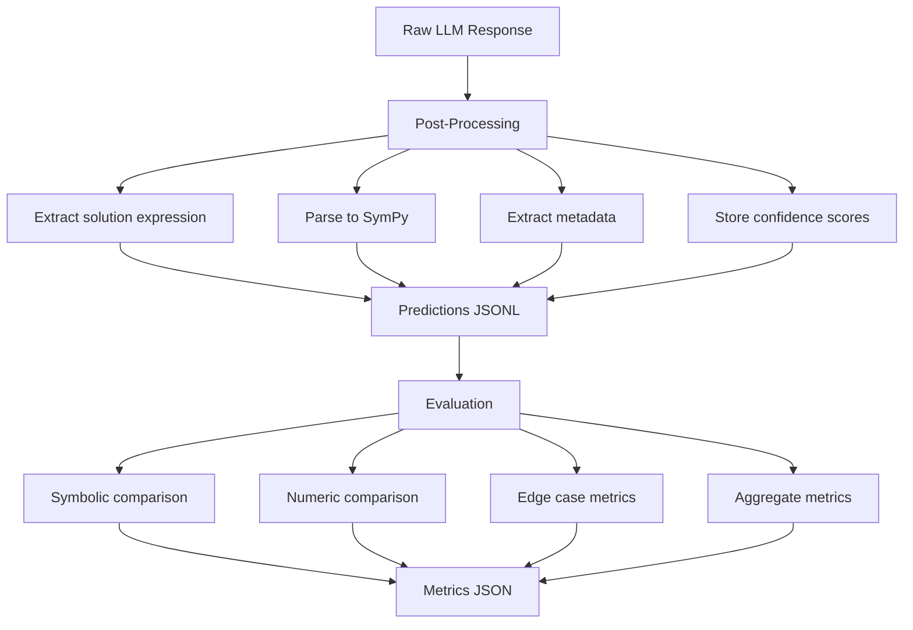

# Evaluation and Post-Processing Pipeline

Comprehensive guide to how LLM predictions are processed, evaluated, and scored in fred-llm.

## Overview

The pipeline consists of two main stages:

1. **Post-Processing** – Extract and parse raw LLM output into structured fields
2. **Evaluation** – Compare extracted solutions against ground truth using symbolic and numeric methods



---

## Post-Processing Flow Diagram

### Complete Pipeline (All Formats)

```mermaid
flowchart TD
    LLM[Raw LLM Response<br/>with reasoning text] --> MetaExtract[Metadata Extraction]
    
    MetaExtract --> HasSol[Extract HAS_SOLUTION]
    MetaExtract --> SolType[Extract SOLUTION_TYPE]
    MetaExtract --> Reason[Extract REASONING]
    
    HasSol --> FormatDetect[Format Detection]
    SolType --> FormatDetect
    Reason --> FormatDetect
    
    FormatDetect --> |LaTeX| LaTeXPath[LaTeX Format]
    FormatDetect --> |Infix| InfixPath[Infix Format]
    FormatDetect --> |RPN| RPNPath[RPN Format]
    
    LaTeXPath --> Strategy1[Strategy 1: Math-Verify]
    InfixPath --> Strategy1
    RPNPath --> Strategy2[Strategy 2: Regex Fallback]
    
    Strategy1 --> |Available & Not RPN| MV1[① Targeted u&#40;x&#41;= pattern]
    Strategy1 --> |Fallback| MV2[② SOLUTION: marker]
    Strategy1 --> |Fallback| MV3[③ Full response parse]
    
    MV1 --> MVSuccess{Success?}
    MV2 --> MVSuccess
    MV3 --> MVSuccess
    
    MVSuccess --> |Yes| MVResult[Extract expr, str<br/>confidence = 0.8]
    MVSuccess --> |No| Strategy2
    
    Strategy2 --> RegexPat[Apply Regex Patterns]
    RegexPat --> |Priority 1| Pat1["SOLUTION: u&#40;x&#41; = ..."]
    RegexPat --> |Priority 2| Pat2["Solution: u&#40;x&#41; = ..."]
    RegexPat --> |Priority 3| Pat3["Generic u&#40;x&#41; = ..."]
    
    Pat1 --> Clean[_clean_expression]
    Pat2 --> Clean
    Pat3 --> Clean
    
    Clean --> SolStr[solution_str<br/>extracted string]
    
    MVResult --> ParseSymPy[Parse to SymPy]
    SolStr --> ParseSymPy
    
    ParseSymPy --> |LaTeX| MVParse[Math-Verify parse]
    ParseSymPy --> |LaTeX fallback| LatexInfix[_latex_to_infix + parse_expr]
    ParseSymPy --> |Infix| DirectParse[parse_expr directly]
    ParseSymPy --> |RPN| RPNConvert[rpn_to_sympy]
    
    MVParse --> ParseSuccess{Success?}
    LatexInfix --> ParseSuccess
    DirectParse --> ParseSuccess
    RPNConvert --> ParseSuccess
    
    ParseSuccess --> |Yes| SymPyExpr[solution_sympy = SymPy Expr<br/>confidence = 0.7-0.8]
    ParseSuccess --> |No| ParseFail[solution_sympy = None<br/>confidence = 0.0-0.3]
    
    SymPyExpr --> Output[Output Dictionary]
    ParseFail --> Output
    
    Output --> |Contains| RawResp[raw_response: str]
    Output --> |Contains| SolStrOut[solution_str: str]
    Output --> |Contains| SolSymOut[solution_sympy: Expr]
    Output --> |Contains| HasSolOut[has_solution: bool]
    Output --> |Contains| SolTypeOut[solution_type: str]
    Output --> |Contains| ReasonOut[reasoning: str]
    Output --> |Contains| ConfOut[confidence: float]
    
    RawResp --> WriteJSON[Write to predictions.jsonl]
    SolStrOut --> WriteJSON
    SolSymOut --> WriteJSON
    HasSolOut --> WriteJSON
    SolTypeOut --> WriteJSON
    ReasonOut --> WriteJSON
    ConfOut --> WriteJSON
    
    style MVResult fill:#90EE90
    style Strategy1 fill:#FFD700
    style Strategy2 fill:#FFA500
    style SymPyExpr fill:#90EE90
    style ParseFail fill:#FF6B6B
```



### Format-Specific Processing

#### LaTeX Format

```mermaid
flowchart LR
    LaTeX["LaTeX String<br/>x^2 + \sin&#40;x&#41;"] --> Try1[Try Math-Verify parse]
    
    Try1 --> |Available| MVParser[ANTLR grammar parser]
    MVParser --> MVSuccess[✓ SymPy expression<br/>confidence = 0.8]
    
    Try1 --> |Unavailable/Failed| Fallback[Fallback: _latex_to_infix]
    Fallback --> Replace1["\sin → sin"]
    Replace1 --> Replace2["^{2} → **2"]
    Replace2 --> Replace3["\frac{a}{b} → &#40;a&#41;/&#40;b&#41;"]
    Replace3 --> ParseExpr[parse_expr&#40;infix_str&#41;]
    ParseExpr --> InfixSuccess[✓ SymPy expression<br/>confidence = 0.7]
    
    style MVSuccess fill:#90EE90
    style InfixSuccess fill:#FFD700
```



#### Infix Format

```mermaid
flowchart LR
    Infix["Infix String<br/>x**2 + sin&#40;x&#41;"] --> Direct[parse_expr directly]
    Direct --> SymPy[SymPy standard parser]
    SymPy --> Success[✓ SymPy expression<br/>confidence = 0.7]
    
    style Success fill:#FFD700
```



#### RPN Format

```mermaid
flowchart TD
    RPN["RPN String<br/>x 2 ^ x sin +"] --> Convert[rpn_to_sympy]
    Convert --> Stack[Stack-based evaluation]
    
    Stack --> Step1["① Push: x, 2"]
    Step1 --> Step2["② Pop 2, Apply ^<br/>Push: x**2"]
    Step2 --> Step3["③ Push: x"]
    Step3 --> Step4["④ Pop 1, Apply sin<br/>Push: sin&#40;x&#41;"]
    Step4 --> Step5["⑤ Pop 2, Apply +<br/>Result: x**2 + sin&#40;x&#41;"]
    Step5 --> Result[✓ SymPy expression<br/>confidence = 0.7]
    
    Convert -.->|Note| NoMV[⚠️ Math-Verify<br/>cannot parse RPN]
    
    style Result fill:#FFD700
    style NoMV fill:#FF6B6B
```



---

## Part 1: Post-Processing Pipeline

### Location
- **Main module**: [src/llm/postprocess.py](src/llm/postprocess.py)
- **Math-Verify adapter**: [src/llm/math_verify_adapter.py](src/llm/math_verify_adapter.py)

### Function: `parse_llm_output()`

Extracts mathematical content from raw LLM response text.

```python
result = parse_llm_output(
    response="To solve...\nSOLUTION: u(x) = x**2 + sin(x)\n...",
    extract_solution=True,
    validate=True,
)
```

### Output Fields

| Field | Type | Source | Description |
|-------|------|--------|-------------|
| `raw_response` | str | Input | Untouched full LLM response with reasoning |
| `solution_str` | str | Extraction | Extracted solution expression (e.g., `-x**2 + sin(x)`) |
| `solution_sympy` | SymPy | Parsing | Canonicalized SymPy expression object |
| `has_solution` | bool \| None | Regex | Whether solution exists (parsed from YES/NO) |
| `solution_type` | str \| None | Regex | Solution classification (exact_symbolic, series, family, etc.) |
| `confidence` | float | Strategy | Confidence score (0.8 for Math-Verify, 0.7 for SymPy, 0.3 for errors) |
| `reasoning` | str \| None | Extraction | Extracted reasoning steps (if present) |

---

## Part 2: Solution Extraction Strategies

### Strategy 1: Math-Verify (Primary) ✓ LaTeX & Infix Only

**Available for**: LaTeX, Infix formats

Uses HuggingFace Math-Verify library for robust mathematical expression parsing.

```python
from src.llm.math_verify_adapter import extract_solution_from_response

mv_result = extract_solution_from_response(response)
if mv_result is not None:
    sympy_expr, raw_str = mv_result
    # raw_str = "-797089.48628811292*x + ..."
    # sympy_expr = SymPy expression (ready for comparison)
```

**Multi-strategy approach (most-specific first)**:

1. **Targeted `u(x) =` line** – Find last line matching pattern, parse with Math-Verify
   ```
   Last line: "u(x) = x**2 + sin(x)" → Parse RHS only
   ```

2. **Structured `SOLUTION:` marker** – Extract after `SOLUTION:` line
   ```
   SOLUTION: u(x) = x**2 + sin(x) → Parse content
   ```

3. **Full response parse** – Hand entire response to Math-Verify, find `Eq(u(x), rhs)`
   - Detects scrambled text (e.g., "No solution" parsed as `n*o*s*o*l*u*t*i*o*n`)
   - Filters out nonsense expressions

**Confidence**: 0.8

---

### Strategy 2: Regex Fallback (Legacy)

**Available for**: All formats

When Math-Verify unavailable or returns None, use regex patterns:

```python
patterns = [
    r"^SOLUTION\s*:\s*u\s*\(\s*x\s*\)\s*=\s*(.+?)(?:\n|$)",  # SOLUTION: u(x) = ...
    r"[Ss]olution[:\s]+u\s*\(\s*x\s*\)\s*=\s*(.+?)(?:\n|$)",    # Solution: u(x) = ...
    r"u\s*\(\s*x\s*\)\s*=\s*(.+?)(?:\n|$|\.(?:\s|$))",          # Generic u(x) = ...
]
```

**Cleaning steps**:
- Trim whitespace and trailing periods
- Remove LaTeX delimiters (`$...$`, `\(...\)`)
- Clean up reasoning fragments

**Confidence**: 0.7

---

### Strategy 3: RPN Support

**Available for**: RPN (Reverse Polish Notation)

RPN format: `x 2 ^ x sin +` (postfix notation)

**Process**:
1. Regex extracts the RPN string
2. [rpn_formatter.py](src/data/formatters/rpn_formatter.py) converts RPN → SymPy

**Limitation**: Math-Verify cannot parse RPN (requires LaTeX/infix first)

**Workaround**: Convert RPN to infix before evaluation:
```python
from src.data.formatters.rpn_formatter import rpn_to_sympy

sympy_expr = rpn_to_sympy("x 2 ^ x sin +")
infix_str = str(sympy_expr)  # "x**2 + sin(x)"
```

---

## Part 3: Expression Parsing

### LaTeX → SymPy Conversion

**Process** ([math_verify_adapter.py](src/llm/math_verify_adapter.py)):

```
LaTeX input: "x^{2} + \sin(x)"
    ↓ (Math-Verify)
    ↓ (or custom _latex_to_infix)
Infix form: "x**2 + sin(x)"
    ↓ (parse_expr + TRANSFORMATIONS)
SymPy: x**2 + sin(x)
```

**Symbol Dictionary** (`FREDHOLM_LOCAL_DICT`):

```python
{
    "x": Symbol('x'),
    "t": Symbol('t'),
    "C": Symbol('C'),  # Constants
    "c_1": Symbol('c_1'),  # Subscripted constants
    "pi": π,
    "e": ℯ,
    "Integral": sp.Integral,
    "oo": sp.oo,
}
```

---

## Part 4: Metadata Extraction

### `has_solution` Field

Extracted from YES/NO patterns in response:

```python
def _extract_has_solution(response: str) -> bool | None:
    """Extract HAS_SOLUTION: [yes/no] from response."""
    # Looks for patterns like:
    # - HAS_SOLUTION: yes
    # - SOLUTION_EXISTS: no
    # - "No solution exists"
```

**Fallback logic**:
- If `HAS_SOLUTION` field is missing AND solution was extracted → infer `True`
- If `HAS_SOLUTION` field is missing AND no solution found → infer `False`

---

### `solution_type` Field

Classification of solution structure. Extracted from `SOLUTION_TYPE:` marker:

| Type | Meaning | Example |
|------|---------|---------|
| `exact_symbolic` | Closed-form symbolic | `u(x) = sin(x)` |
| `approx_coef` | Approximate with coefficients | `u(x) ≈ a₀ + a₁x + a₂x²` |
| `series` | Truncated series | `u(x) = term1 + term2 + term3 + term4` |
| `family` | Family of solutions (non-unique) | `u(x) = C·sin(πx)` |
| `discrete_points` | Solution at discrete points only | `[(0.0, 1.2), (0.5, 2.4)]` |
| `regularized` | Ill-posed, requires regularization | |
| `none` | No solution exists | |

---

## Part 5: Evaluation Pipeline

### Location
- **Main module**: [src/llm/evaluate.py](src/llm/evaluate.py)

### Function: `evaluate_solutions()`

Compares extracted solution against ground truth across multiple metrics.

```python
metrics = evaluate_solutions(
    predictions=[
        {
            "solution_sympy": sp.sympify("x**2"),
            "ground_truth": sp.sympify("x**2"),
            "has_solution": True,
            "solution_type": "exact_symbolic",
            ...
        },
        ...
    ],
    domains=[(-2, 2), ...],
)
```

---

### Comparison Methods

#### 1. Symbolic Comparison (`symbolic_compare()`)

Tests whether two expressions are **mathematically equivalent**.

**Process**:

```python
def symbolic_compare(solution, ground_truth):
    # Step 1: Math-Verify fast-path (if available)
    if HAS_MATH_VERIFY:
        mv_result = math_verify_compare(solution, ground_truth)
        if mv_result is True:
            return {"equivalent": True, "simplified_match": True}
    
    # Step 2: SymPy simplification strategies
    # Try direct equality
    if simplify(solution - ground_truth) == 0:
        return {"equivalent": True}
    
    # Try trig simplification
    if trigsimp(solution - ground_truth) == 0:
        return {"equivalent": True}
    
    # Try expansion
    if expand(solution - ground_truth) == 0:
        return {"equivalent": True}
    
    return {"equivalent": False}
```

**Metric**: `symbolic_accuracy` – % of solutions matching ground truth

---

#### 2. Numeric Comparison (`numeric_compare()`)

Tests equivalence by **sampling domain points**.

**Process**:

```python
def numeric_compare(solution, ground_truth, domain=(-1, 1), n_points=100):
    # Sample n_points uniformly across domain
    # Evaluate both expressions at each point
    # Check if |solution(x) - ground_truth(x)| < tolerance
    
    # Examples:
    # x**2 vs x*x → All points match ✓
    # x**3 vs x**2 → Most points differ ✗
```

**Metric**: `numeric_accuracy` – % of sampled points within tolerance

**Numeric outputs:** `max_error`, `mean_error`, `mae`, `rmse`, plus optional per-point arrays when enabled.

**Note:** If `evaluation_points` are present in the prediction metadata, numeric comparison uses those stored points instead of generating new samples.

---

### Type-Specific Evaluators

Additional evaluators run when `solution_type` matches and record metadata in each prediction's `evaluation` field.

#### `discrete_points`
- Point-wise comparison with x/y tolerances
- Metrics: `matched_points`, `accuracy`, `max_error`, `mean_error`, `rmse`

#### `series`
- Term-by-term numeric RMSE over top-level terms
- Metadata: `series_term_eval` + term count stats

#### `approx_coef`
- Per-term coefficient comparison
- Metadata: `approx_coef_eval` + aggregated stats

#### `family`
- Multi-sample numeric comparison for free constants
- Term-by-term numeric RMSE after substitution
- Metadata: `family_param_eval` (parameter count + naming)
- Includes std for max/mean/rmse across samples (`*_std`)

---

### Edge Case Metrics

#### `has_solution_accuracy`

Compares `has_solution` (bool) against `ground_truth_has_solution`:

```python
if predicted["has_solution"] == ground_truth["has_solution"]:
    correct += 1
```

**Metric**: % of correct YES/NO predictions

---

#### `solution_type_accuracy`

Compares `solution_type` (string classification) against `ground_truth_solution_type`:

```python
if predicted["solution_type"] == ground_truth["solution_type"]:
    correct += 1
```

**Metric**: % of correct type classifications

---

### Metrics Output

#### `metrics_*.json`

Aggregated evaluation results across all predictions:

```json
{
  "total": 100,
  "correct": 12,
  "accuracy": 0.12,                      // Overall symbolic accuracy
  "symbolic_accuracy": 0.03,             // % matching via simplification
  "numeric_accuracy": 0.03,              // % matching via sampling
  
  "per_type": {                          // Breakdown by solution_type
    "exact_symbolic": {
      "total": 25,
      "correct": 0,
      "accuracy": 0.0
    },
    "series": { "total": 6, ... },
    "family": { "total": 10, ... },
    ...
  },
  
  "has_solution_accuracy": 0.66,        // Edge case: YES/NO correctness
  "solution_type_accuracy": 0.07,       // Edge case: type classification

    "confusion_matrix": {                 // NEW
        "approx_coef_predicted_as_family": 3,
        "series_predicted_as_exact_symbolic": 2
    },
  
  "api_errors": 0,                      // Failed API calls
  "parse_errors": 10,                   // Failed extractions
}
```

---

### Predictions Output

#### `predictions_*.jsonl`

Each line is one test case (JSON objects separated by newlines):

```jsonl
{
  "equation_id": "test100_series_2",
  "prompt": "You are an expert...",
  "ground_truth": "- 797089.48628811292 x + ...",
  
  "raw_response": "To solve...\nSOLUTION: u(x) = ...",
  "api_error": false,
  
  "solution_str": "-797089.48628811292*x + ...",
  "solution_sympy": "-797089.48628811292*x + cosh(x) - ...",
  "has_solution": false,
  "solution_type": "none",
  "reasoning": "This equation...",
  "confidence": 0.8
}
```

#### `predictions_evaluated_*.jsonl`

When running the adaptive pipeline, an evaluated file is also emitted with per-case metrics:

```jsonl
{
    "equation_id": "test100_series_2",
    "solution_type": "series",
    "solution_str": "term1 + term2 + term3 + term4",
    "ground_truth": "term1 + term2 + term3 + term4",
    "evaluation": {
        "correct": true,
        "symbolic_match": false,
        "numeric_match": true,
        "series_term_eval": {
            "term_rmse": [0.0, 0.01, 0.02, 0.03]
        },
        "numeric": {
            "mae": 0.0,
            "x_values": [0.0, 0.1],
            "y_pred": [0.0, 0.1],
            "y_true": [0.0, 0.1],
            "points_source": "evaluation_points"
        }
    }
}
```

**Reading predictions**:

```python
import json

with open("outputs/test_100/predictions_20260206_120237.jsonl") as f:
    for line in f:
        data = json.loads(line)
        print(f"{data['equation_id']}: {data['solution_str']}")
        print(f"  Ground truth: {data['ground_truth']}")
        print(f"  Type: {data['solution_type']}")
```

---

## Part 6: Format Support

### Infix Format

**Example**: `x**2 + sin(x)`

**Prompt instruction**:
```
Express your solution in infix notation (e.g., x**2 + sin(x), exp(-x)*cos(x)).
```

**Math-Verify**: ✓ Supported

**SymPy**: ✓ Native format

---

### LaTeX Format

**Example**: `x^2 + \sin(x)` or `x^{2} + \sin(x)`

**Prompt instruction**:
```
Express your solution in LaTeX notation (e.g., x^2 + \sin(x), e^{-x}\cos(x)).
```

**Math-Verify**: ✓ Fully supported (primary use case)

**SymPy**: Requires conversion via `_latex_to_infix()`

---

### RPN Format

**Example**: `x 2 ^ x sin +` (postfix notation)

**Prompt instruction**:
```
Express your solution in Reverse Polish Notation (e.g., x 2 ^ x sin +, x neg exp x cos *).
```

**Math-Verify**: ✗ Not supported (requires LaTeX/infix)

**SymPy**: Via [rpn_formatter.py](src/data/formatters/rpn_formatter.py)

**Workaround** (if Math-Verify needed):
```python
from src.data.formatters.rpn_formatter import rpn_to_sympy

rpn_solution = "x 2 ^ x sin +"
sympy_expr = rpn_to_sympy(rpn_solution)
infix_str = str(sympy_expr)  # "x**2 + sin(x)"
# Now can use with Math-Verify
```

---

## Part 7: Confidence Scores

| Source | Score | Meaning |
|--------|-------|---------|
| Math-Verify extraction | 0.8 | Robust LaTeX parsing, high reliability |
| Regex + SymPy parsing | 0.7 | Successful extraction and validation |
| Fallback (errors ignored) | 0.3 | Partial parsing, validation failed |
| No extraction | 0.0 | Failed to extract any solution |

```python
if result["confidence"] >= 0.7:
    # Safe to use for evaluation
    evaluate_solution(result)
else:
    logger.warning(f"Low confidence: {result['confidence']}")
```

---

## Part 8: New Evaluation Metrics (February 13, 2026)

### ✅ BLEU Score - Token-Level String Similarity

**What it measures**: Similarity between predicted and ground truth solution **strings**.

**Input format**: **Raw solution strings** (not SymPy!)
- Predicted: `data["solution_str"]` – extracted string from LLM
- Ground truth: `data["ground_truth"]` – reference string

**How it works**:
```python
def bleu_score(pred_str: str, gt_str: str) -> float:
    """Tokenize both strings by math operators, compute NLTK BLEU."""
    # "x**2 + 1" → ["x", "**", "2", "+", "1"]
    ref_tokens = _tokenize_math(gt_str)
    hyp_tokens = _tokenize_math(pred_str)
    return sentence_bleu([ref_tokens], hyp_tokens, smoothing_function=...")
```

**Handles different input formats**:
- ✅ **Infix**: Works perfectly – tokenizes directly
  - Input: `"x**2 + sin(x)"`
  - Tokens: `["x", "**", "2", "+", "sin", "(", "x", ")"]`
- ✅ **LaTeX**: Works – compares LaTeX strings as-is
  - Input: `"x^{2} + \sin(x)"`
  - Tokens: `["x", "^", "{", "2", "}", "+", "\sin", "(", "x", ")"]`
- ✅ **RPN**: Works – compares RPN tokens
  - Input: `"x 2 ^ x sin +"`
  - Tokens: `["x", "2", "^", "x", "sin", "+"]`

**Returns**: Float in [0.0, 1.0]
- 1.0 = perfect token match
- 0.0 = completely different

**When to use**: 
- Quick check if structure is similar
- Not mathematically aware (treats `x**2` and `2**x` as completely different)
- Good for catching typos in coefficients

---

### ✅ Operator F1 - Structural Comparison

**What it measures**: F1 (precision/recall) of **used mathematical operators**.

**Input format**: **SymPy expressions** (parsed solutions)
- Predicted: Parsed to SymPy: `solution_sympy`
- Ground truth: Parsed to SymPy from `ground_truth` string

**How it works**:
```python
def operator_f1(pred_expr: sp.Expr, gt_expr: sp.Expr):
    """Extract operators: {sin, cos, Add, Pow, ...}. Compare as sets."""
    pred_ops = extract_operators(pred_expr)      # {"sin", "Add", "Pow"}
    gt_ops = extract_operators(gt_expr)          # {"sin", "Add"}
    # Compute precision, recall, F1
```

**Handles different input formats**:
- ✅ **Infix** → Parsed directly to SymPy
  - `"x**2 + sin(x)"` → SymPy expression → ops: `{"Pow", "Add", "sin"}`
- ✅ **LaTeX** → Math-Verify or regex → SymPy
  - `"x^{2} + \sin(x)"` → **converted to infix** → SymPy → ops: `{"Pow", "Add", "sin"}`
- ✅ **RPN** → `rpn_to_sympy()` → SymPy
  - `"x 2 ^ x sin +"` → **converted to SymPy** → ops: `{"Pow", "Add", "sin"}`

**Tracked operators**: sin, cos, tan, exp, log, sqrt, sinh, cosh, tanh, Abs, Add, Mul, Pow, Integral

**Returns**: Dict with precision, recall, F1 in [0.0, 1.0]

---

### ✅ None-Type Detection - Precision/Recall/F1

**What it measures**: Accuracy of detecting "no solution exists" cases.

**Input format**: **Boolean from Predictions**
- Predicted: `has_solution` (bool or None)
- Ground truth: `ground_truth_has_solution` (bool)

**How it works**:
```python
# For all predictions where ground_truth_solution_type == "none":
if has_solution == False:  # ✓ TRUE POSITIVE
    tp += 1
elif has_solution == True:  # ✗ FALSE NEGATIVE
    fn += 1
    
# For all other cases:
if has_solution == False:  # ✗ FALSE POSITIVE (incorrectly said no solution)
    fp += 1
```

**Handles different input formats**: **N/A** – Only uses boolean flags, not the solution itself

**Returns**: Dict with precision, recall, F1, tp, fp, fn

---

### ✅ Residual Verification - Fredholm Equation Satisfaction

**What it measures**: Does the predicted solution **actually satisfy the Fredholm equation**?

**Input format**: **SymPy expressions**
- Predicted: Parsed solution `solution_sympy`
- Ground truth: Kernel `K(x,t)`, RHS `f(x)`, Lambda `λ`

**Equation checked**:
$$u(x) - \lambda \int_a^b K(x,t) u(t) dt = f(x)$$

**How it works**:
```python
def verify_solution(solution, kernel, f, lambda_val, domain=(0,1)):
    """Compute residual = solution - λ*integral(kernel*solution) - f.
    Check if |residual| < tolerance."""
```

**Handles different input formats**:
- ✅ **Infix** → SymPy → evaluate
- ✅ **LaTeX** → Math-Verify → SymPy → evaluate
- ✅ **RPN** → rpn_to_sympy → SymPy → evaluate

**Returns**: Dict with verified (bool), residual_max, residual_mean

---

### ✅ Relative L2 Error - Scale-Invariant Numeric

**What it measures**: Normalized error $\frac{\|pred - true\|_2}{\|true\|_2}$ (scale-independent).

**Input format**: **SymPy expressions** (evaluated numerically)
- Predicted: Parsed solution `solution_sympy`
- Ground truth: Either SymPy expression OR **evaluation_points dict** with pre-computed values

**How it works**:
```python
def numeric_compare(solution, ground_truth, ...):
    if isinstance(ground_truth, dict) and "evaluation_points" in ground_truth:
        # Use stored points!
        test_points = ground_truth["evaluation_points"]["x_values"]
        y_truth = ground_truth["evaluation_points"]["u_values"]
    else:
        # Generate new points
        test_points = np.linspace(*domain, n_points)
        y_truth = lambdify(ground_truth)(test_points)
    
    y_pred = lambdify(solution)(test_points)
    errors = y_pred - y_truth
    rel_l2 = np.sqrt(sum(errors**2)) / np.sqrt(sum(y_truth**2))
```

**Handles different input formats**:
- ✅ **Infix** → SymPy → lambdify → numeric evaluation
- ✅ **LaTeX** → Math-Verify → SymPy → lambdify → numeric evaluation
- ✅ **RPN** → rpn_to_sympy → SymPy → lambdify → numeric evaluation

**Returns**: Float in [0.0, inf]
- 0.0 = identical
- 0.1 = 10% error (scale-independent)
- inf = ground truth is zero but prediction is nonzero

---

## Part 9: Evaluation Points vs. Numeric Metrics

### ⚠️ IMPORTANT DISTINCTION

**Evaluation Points** (stored in dataset) and **Numeric Comparison** (computed per evaluation) are **DIFFERENT**:

#### Evaluation Points (Pre-Computed in Data)
```python
# Generated ONCE during augmentation, stored in dataset
{
    "x": {...},
    "f": {...},
    "u": "sin(x)",
    "evaluation_points": {
        "x_values": [0.0, 0.01, 0.02, ..., 1.0],          # 50 points
        "u_values": [0.0, 0.0099..., 0.0198..., ..., 0.84...],  # Ground truth evaluated here
    }
}
```

**Purpose**: 
- ✅ Consistent evaluation across all runs (same test points every time)
- ✅ Includes carefully chosen points (boundaries, critical points)
- ✅ Pre-computed so ground truth values don't change
- ✅ For **ground truth function only**

#### Numeric Comparison (Computed During Evaluation)
```python
# Computed PER EVALUATION RUN
numeric_compare(
    solution=parsed_llm_solution,    # What LLM predicted
    ground_truth={...},              # Ground truth data
    domain=(0, 1),
    n_points=100                     # Can be different each time!
)
```

**Process**:
1. IF evaluation_points available in ground_truth → Use them (50 points from dataset)
2. If not → Generate new points: `np.linspace(a, b, n_points)` (default 100)
3. Evaluate **predicted solution** at these points
4. Compare with ground truth values at same points

**Important**: 
- ✅ Predicted solution is **always converted to SymPy and evaluated numerically**
- ✅ Ground truth uses pre-computed or generated points
- ⚠️ Without evaluation_points, numeric metrics vary across runs

---

## Part 10: Complete Metric Comparison Table

---

## Part 9: Common Issues & Troubleshooting

### Issue: `has_solution` is None

**Cause**: Response didn't contain explicit YES/NO marker

**Fix**: 
- Prompt more clearly asks for `HAS_SOLUTION: [yes/no]`
- Post-processing infers from presence of solution expression

### Issue: `solution_sympy` is None but `solution_str` exists

**Cause**: Expression couldn't be parsed to SymPy (syntax error, unknown symbols)

**Fix**:
- Check `raw_response` for malformed LaTeX
- Add symbol to `FREDHOLM_LOCAL_DICT` if domain-specific

### Issue: Math-Verify returns None

**Cause**: 
- Expression not in LaTeX/infix format (e.g., RPN)
- Malformed LaTeX
- Module not installed (`HAS_MATH_VERIFY = False`)

**Fix**:
- Install: `pip install math-verify[antlr4_13_2]`
- Convert RPN to infix first
- Check LaTeX syntax

### Issue: `accuracy` very low (< 5%)

**Cause**: 
- Solutions are symbolically correct but not matching simplification
- Numeric evaluation with wrong domain
- Ground truth format mismatch

**Debug**:
```python
# Check a specific case
data = json.loads(predictions_line)
print(f"Extracted: {data['solution_str']}")
print(f"Ground truth: {data['ground_truth']}")
print(f"SymPy extracted: {data['solution_sympy']}")

# Try manual symbolic comparison
from src.llm.evaluate import symbolic_compare
result = symbolic_compare(
    sp.sympify(data['solution_str']),
    sp.sympify(data['ground_truth'])
)
print(f"Match: {result['equivalent']}")
```

---

## Part 10: Running Evaluation

### Full Pipeline

```bash
# 1. Generate predictions
python -m src.cli run --config configs/test_100.yaml

# 2. Outputs created:
# - outputs/test_100/predictions_TIMESTAMP.jsonl
# - outputs/test_100/metrics_TIMESTAMP.json
# - outputs/test_100/cost_summary_TIMESTAMP.json
```

### Evaluate Existing Predictions

```python
from src.llm.evaluate import evaluate_solutions
import json

predictions = []
with open("outputs/test_100/predictions_20260206_120237.jsonl") as f:
    for line in f:
        predictions.append(json.loads(line))

metrics = evaluate_solutions(predictions)
print(f"Overall accuracy: {metrics['accuracy']:.1%}")
print(f"Symbolic accuracy: {metrics['symbolic_accuracy']:.1%}")
```

---

## Part 10: Metric Input/Output Reference

### Quick Reference: Which Input Does Each Metric Use?

| **Metric** | **Input Form** | **Data Source** | **Raw Text** | **Parsed String** | **SymPy Expr** | **Handles RPN** | **Handles LaTeX** | **Handles Infix** |
|---|---|---|---|---|---|---|---|---|
| **BLEU Score** | Solution string | `solution_str` | ✅ Yes | ✅ Yes | ❌ No | ✅ Yes | ✅ Yes | ✅ Yes |
| **Operator F1** | SymPy expr | `solution_sympy` | ❌ No | ❌ No | ✅ Yes | ✅ (after convert) | ✅ (after convert) | ✅ (direct) |
| **None-Detection** | Boolean | `has_solution` | ❌ No | ❌ No | ❌ No | ❌ No | ❌ No | ❌ No |
| **Residual Verify** | SymPy expr | `solution_sympy` | ❌ No | ❌ No | ✅ Yes | ✅ (after convert) | ✅ (after convert) | ✅ (direct) |
| **Relative L2** | SymPy expr | `solution_sympy` | ❌ No | ❌ No | ✅ Yes | ✅ (after convert) | ✅ (after convert) | ✅ (direct) |
| **Symbolic Compare** | SymPy expr | `solution_sympy` | ❌ No | ❌ No | ✅ Yes | ✅ (after convert) | ✅ (after convert) | ✅ (direct) |
| **Numeric Compare** | SymPy expr | `solution_sympy` | ❌ No | ❌ No | ✅ Yes | ✅ (after convert) | ✅ (after convert) | ✅ (direct) |

### Legend:
- **Input Form**: What the metric actually processes
- **Data Source**: Where to get it from the parsed output
- **Raw Text**: Works with unparsed LLM output?
- **Parsed String**: Works with cleaned but unparsed strings?
- **SymPy Expr**: Works with parsed symbolic expressions?
- **Handles RPN**: Can process RPN format solutions?
- **Handles LaTeX**: Can process LaTeX format solutions?
- **Handles Infix**: Can process standard infix notation solutions?

### Format Conversion Pipeline

**All input formats → SymPy pipeline:**

```
RPN (Reverse Polish Notation)
  ↓
rpn_to_sympy() converter
  ↓
SymPy Expression ←→ [Use SymPy-based metrics]

LaTeX Format
  ↓
Math-Verify (primary) OR Regex fallback
  ↓
Infix string
  ↓
SymPy parse
  ↓
SymPy Expression ←→ [Use SymPy-based metrics]

Infix Format (standard math notation)
  ↓
SymPy parse (direct)
  ↓
SymPy Expression ←→ [Use SymPy-based metrics]
```

### Data Flow for Different Metrics

#### BLEU Score (String-based)
```
LLM Response
  ↓ parse_llm_output()
  ├─ raw_response: "Let me solve... u(x) = x**2 + sin(x), therefore..."
  ├─ solution_str: "x**2 + sin(x)"
  └─ solution_sympy: Symbol('x')**2 + sin(Symbol('x'))

BLEU Score Calculation:
  pred_str = "x**2 + sin(x)"  ← Uses solution_str!
  gt_str = "sin(x) + x**2"    ← Ground truth string
  
  Tokenize both: ["x", "**", "2", "+", "sin", "(", "x", ")"]
                   ["sin", "(", "x", ")", "+", "x", "**", "2"]
  
  Return: BLEU score in [0.0, 1.0]
```

**Key point**: BLEU only needs the **extracted string**, not the full raw response with reasoning!

#### Operator F1 (SymPy-based)
```
LLM Response
  ↓ parse_llm_output()
  ├─ raw_response: "Let me solve... u(x) = x**2 + sin(x), therefore..."
  ├─ solution_str: "x**2 + sin(x)"
  └─ solution_sympy: Symbol('x')**2 + sin(Symbol('x')) ← Uses this!

Operator F1 Calculation:
  extract_operators(solution_sympy)
    ↓ Walk SymPy tree
    ↓ Find all node types: Pow, Add, sin
  
  pred_ops = {"Pow", "Add", "sin"}
  gt_ops = {"Pow", "sin", "Add"}
  
  precision = |intersection| / |pred_ops|
  recall = |intersection| / |gt_ops|
  f1 = 2 * (precision * recall) / (precision + recall)
```

**Key point**: Operator F1 only needs **parsed SymPy expression**, never touches raw text!

#### Relative L2 Error (SymPy evaluated)
```
LLM Response
  ↓ parse_llm_output()
  ├─ solution_str: "x**2 + sin(x)"
  └─ solution_sympy: Symbol('x')**2 + sin(Symbol('x')) ← Uses this!

Ground Truth
  ├─ evaluation_points (if available):
  │  ├─ x_values: [0.0, 0.01, 0.02, ..., 1.0]  ← 50 pre-computed points
  │  └─ u_values: [0.0, 0.0099..., 0.0198..., ...]
  │
  └─ OR generated on-the-fly:
     └─ np.linspace(0, 1, 100)  ← 100 random points

Relative L2 Calculation:
  y_pred = lambdify(solution_sympy, 'x')(x_values)
  y_truth = evaluation_points['u_values']  ← Pre-computed!
  
  error = y_pred - y_truth
  rel_l2 = sqrt(sum(error**2)) / sqrt(sum(y_truth**2))
```

**Key point**: 
- Uses **parsed SymPy expression** for prediction
- Uses **stored evaluation_points** for ground truth (when available)
- Avoids recomputing ground truth every evaluation

---

## Part 11: Evaluation Results Organization

After evaluation, results are organized by metric type:

```python
{
    "string_metrics": {
        "bleu": 0.85,
        "bleu_score": 0.85  # Alternative name
    },
    "structural_metrics": {
        "operator_f1": {
            "precision": 0.90,
            "recall": 0.88,
            "f1": 0.89,
            "gt_operators": ["Pow", "sin", "Add"],
            "pred_operators": ["Pow", "sin", "Add"]
        }
    },
    "detection_metrics": {
        "none_type": {
            "precision": 0.95,
            "recall": 0.92,
            "f1": 0.93,
            "tp": 15,
            "fp": 1,
            "fn": 2
        }
    },
    "verification_metrics": {
        "residual_verification": {
            "verified": True,
            "residual_max": 1e-6,
            "residual_mean": 1e-7
        }
    },
    "numeric_metrics": {
        "relative_l2": 0.021,  # 2.1% error
        "rmse": 0.045,
        "mae": 0.032,
        "max_error": 0.15
    },
    "symbolic_metrics": {
        "equivalent": True,
        "simplified_match": False
    },
    "aggregated": {
        "numeric_accuracy": 0.98,  # rel_l2 < 0.05
        "symbolic_accuracy": 0.92,  # simplified_match or equivalent
        "overall_score": 0.95
    }
}
```

---

## References

- [Math-Verify Library](https://github.com/openai/math-verify)
- [SymPy Documentation](https://docs.sympy.org/)
- [LaTeX Math Reference](https://en.wikibooks.org/wiki/LaTeX/Mathematics)
- Project docs: [FEATURES.md](FEATURES.md), [QUICKSTART.md](QUICKSTART.md)
