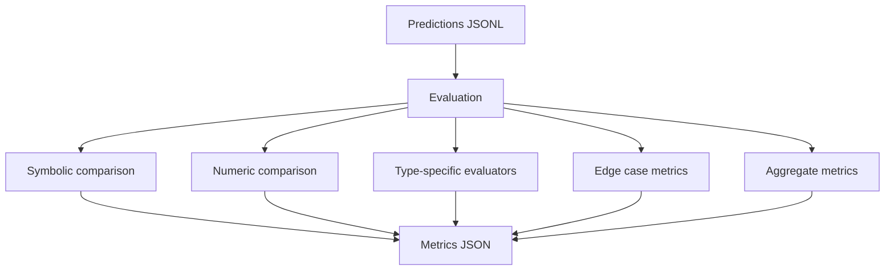

# Evaluation Pipeline

This document covers how predictions are evaluated and scored.

Related docs:
- [docs/POSTPROCESSING_FLOW.md](docs/POSTPROCESSING_FLOW.md)
- [docs/METRICS_REFERENCE.md](docs/METRICS_REFERENCE.md)

## Overview



---

## Location

- Main module: [src/llm/evaluate.py](src/llm/evaluate.py)

## Function: evaluate_solutions()

Compares extracted solutions against ground truth across multiple metrics.

```python
metrics = evaluate_solutions(
    predictions=[
        {
            "solution_sympy": sp.sympify("x**2"),
            "ground_truth": sp.sympify("x**2"),
            "has_solution": True,
            "solution_type": "exact_symbolic",
        },
    ],
    domains=[(-2, 2)],
)
```

---

## Comparison Methods

### 1. Symbolic Comparison (symbolic_compare)

Tests whether two expressions are mathematically equivalent.

```python
def symbolic_compare(solution, ground_truth):
    if HAS_MATH_VERIFY:
        mv_result = math_verify_compare(solution, ground_truth)
        if mv_result is True:
            return {"equivalent": True, "simplified_match": True}

    if simplify(solution - ground_truth) == 0:
        return {"equivalent": True}
    if trigsimp(solution - ground_truth) == 0:
        return {"equivalent": True}
    if expand(solution - ground_truth) == 0:
        return {"equivalent": True}

    return {"equivalent": False}
```

Metric: symbolic_accuracy (percent matching via simplification)

---

### 2. Numeric Comparison (numeric_compare)

Tests equivalence by sampling domain points.

```python
def numeric_compare(solution, ground_truth, domain=(-1, 1), n_points=100):
    # Sample points, evaluate both expressions, compare with tolerance
```

Metric: numeric_accuracy (percent within tolerance)

Note: If evaluation_points are present in ground_truth, numeric comparison uses those stored points instead of generating new samples.

---

## Type-Specific Evaluators

Additional evaluators run when solution_type matches and write results under evaluation.

- discrete_points: point-wise comparison with x/y tolerances
- series: term-by-term numeric RMSE over top-level terms
- approx_coef: per-term coefficient comparison
- family: numeric comparison for free constants (multiple samples)

---

## Edge Case Metrics

### has_solution_accuracy

Compares has_solution against ground_truth_has_solution.

```python
if predicted["has_solution"] == ground_truth["has_solution"]:
    correct += 1
```

### solution_type_accuracy

Compares solution_type against ground_truth_solution_type.

```python
if predicted["solution_type"] == ground_truth["solution_type"]:
    correct += 1

---

## Residual Verification

Residual verification checks whether a predicted solution satisfies the
Fredholm equation. It uses evaluation_points.x_values when available;
otherwise it samples x values with a reproducible random generator.

Outputs:
- verified
- residual_max
- residual_mean
- residual_mae
- residual_rmse
```

---

## Output Files

### metrics_*.json

Aggregated evaluation results across all predictions.

```json
{
  "total": 100,
  "correct": 12,
  "accuracy": 0.12,
  "symbolic_accuracy": 0.03,
  "numeric_accuracy": 0.03,
  "per_type": {
    "exact_symbolic": {"total": 25, "correct": 0, "accuracy": 0.0},
    "series": {"total": 6}
  },
  "has_solution_accuracy": 0.66,
  "solution_type_accuracy": 0.07,
  "confusion_matrix": {
    "approx_coef_predicted_as_family": 3,
    "series_predicted_as_exact_symbolic": 2
  },
  "api_errors": 0,
  "parse_errors": 10
}
```

### predictions_*.jsonl

Each line is one test case (JSON objects separated by newlines).

```jsonl
{
  "equation_id": "test100_series_2",
  "prompt": "You are an expert...",
  "ground_truth": "- 797089.48628811292 x + ...",
  "raw_response": "To solve...\nSOLUTION: u(x) = ...",
  "api_error": false,
  "solution_str": "-797089.48628811292*x + ...",
  "solution_sympy": "-797089.48628811292*x + cosh(x) - ...",
  "has_solution": false,
  "solution_type": "none",
  "reasoning": "This equation...",
  "confidence": 0.8
}
```

### predictions_evaluated_*.jsonl

Evaluated file with per-case metrics.

```jsonl
{
  "equation_id": "test100_series_2",
  "solution_type": "series",
  "solution_str": "term1 + term2 + term3 + term4",
  "ground_truth": "term1 + term2 + term3 + term4",
  "evaluation": {
    "correct": true,
    "symbolic_match": false,
    "numeric_match": true,
    "series_term_eval": {
      "term_rmse": [0.0, 0.01, 0.02, 0.03]
    },
    "numeric": {
      "mae": 0.0,
      "x_values": [0.0, 0.1],
      "y_pred": [0.0, 0.1],
      "y_true": [0.0, 0.1],
      "points_source": "evaluation_points"
    }
  }
}
```

---

## Running Evaluation

### Full Pipeline

```bash
python -m src.cli run --config configs/test_100.yaml
```

Outputs:
- outputs/test_100/predictions_TIMESTAMP.jsonl
- outputs/test_100/metrics_TIMESTAMP.json
- outputs/test_100/cost_summary_TIMESTAMP.json

### Evaluate Existing Predictions

```python
from src.llm.evaluate import evaluate_solutions
import json

predictions = []
with open("outputs/test_100/predictions_20260206_120237.jsonl") as f:
    for line in f:
        predictions.append(json.loads(line))

metrics = evaluate_solutions(predictions)
print(f"Overall accuracy: {metrics['accuracy']:.1%}")
print(f"Symbolic accuracy: {metrics['symbolic_accuracy']:.1%}")
```

---

## Evaluation-Only Mode

Use this when you already have predictions and only want metrics.

### Predictions vs Evaluated Predictions

- Predictions file (`predictions_*.jsonl`): raw model outputs and ground truth
- Evaluated predictions file (`predictions_evaluated_*.jsonl`): adds RMSE/MAE, match flags, and per-case metrics

### CLI Usage

```bash
python -m src.cli evaluate predictions.jsonl --output metrics.json
```

Options:
- `--mode {symbolic,numeric,both}`
- `--symbolic-tolerance FLOAT`
- `--numeric-tolerance FLOAT`
- `--test-points INT`

### Config Usage (Adaptive Pipeline)

```yaml
dataset:
  evaluation_only:
    predictions_path: outputs/my_run/predictions.jsonl

evaluation:
  mode: both
  symbolic_tolerance: 1e-10
  numeric_tolerance: 1e-6
  num_test_points: 100

output:
  dir: outputs/eval_results
  save_metrics: true
```

Run:
```bash
uv run python -m src.cli run --config configs/eval_only.yaml
```

### Required Input Fields

- `equation_id`
- `ground_truth`
- `solution_str`

Recommended fields:
- `ground_truth_solution_type`, `ground_truth_domain`
- `solution_type`, `has_solution`
- `evaluation_points`

The evaluation accepts JSONL (one object per line) or JSON (list of objects).

---

## Common Issues and Troubleshooting

### has_solution is None

Cause: Response did not contain explicit YES/NO marker.

Fix:
- Prompt for HAS_SOLUTION: yes/no
- Post-processing infers from presence of a solution expression

### solution_sympy is None but solution_str exists

Cause: Expression could not be parsed to SymPy (syntax error, unknown symbols).

Fix:
- Check raw_response for malformed LaTeX
- Add symbols to FREDHOLM_LOCAL_DICT if domain-specific

### Math-Verify returns None

Cause:
- Expression not in LaTeX/infix format (for example RPN)
- Malformed LaTeX
- Module not installed

Fix:
- Install: pip install math-verify[antlr4_13_2]
- Convert RPN to infix first
- Check LaTeX syntax

### Accuracy very low (< 5%)

Cause:
- Solutions are symbolically correct but not matching simplification
- Numeric evaluation with wrong domain
- Ground truth format mismatch

Debug:
```python
import json
import sympy as sp
from src.llm.evaluate import symbolic_compare

with open("outputs/test_100/predictions_20260206_120237.jsonl") as f:
    data = json.loads(next(f))

print(f"Extracted: {data['solution_str']}")
print(f"Ground truth: {data['ground_truth']}")

result = symbolic_compare(
    sp.sympify(data["solution_str"]),
    sp.sympify(data["ground_truth"]),
)
print(f"Match: {result['equivalent']}")
```
