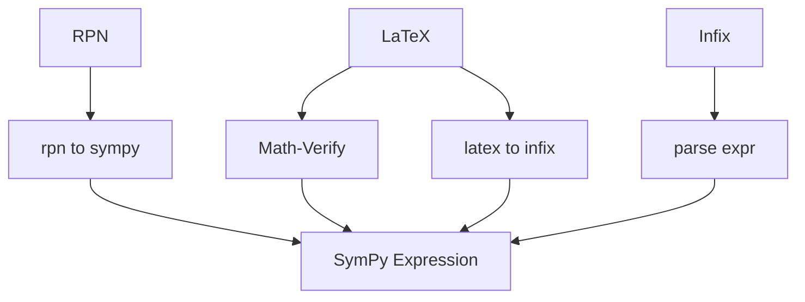

# Metrics Reference

This document describes each evaluation metric and its inputs.

Related docs:
- [docs/POSTPROCESSING_FLOW.md](docs/POSTPROCESSING_FLOW.md)
- [docs/EVALUATION_PIPELINE.md](docs/EVALUATION_PIPELINE.md)

## Quick Reference: Metric Inputs

| Metric | Input Form | Data Source | Raw Text | Parsed String | SymPy Expr | RPN | LaTeX | Infix |
|---|---|---|---|---|---|---|---|---|
| BLEU Score | Solution string | solution_str | Yes | Yes | No | Yes | Yes | Yes |
| Operator F1 | SymPy expr | solution_sympy | No | No | Yes | Yes (after convert) | Yes (after convert) | Yes (direct) |
| None-Detection | Boolean | has_solution | No | No | No | No | No | No |
| Residual Verification | SymPy expr | solution_sympy | No | No | Yes | Yes (after convert) | Yes (after convert) | Yes (direct) |
| Relative L2 | SymPy expr | solution_sympy | No | No | Yes | Yes (after convert) | Yes (after convert) | Yes (direct) |
| Symbolic Compare | SymPy expr | solution_sympy | No | No | Yes | Yes (after convert) | Yes (after convert) | Yes (direct) |
| Numeric Compare | SymPy expr | solution_sympy | No | No | Yes | Yes (after convert) | Yes (after convert) | Yes (direct) |

Notes:
- BLEU uses the extracted solution string, not the raw response text.
- All SymPy-based metrics depend on successful parsing.

---

## Format Conversion Pipeline



---

## Metric Details

### BLEU Score (String Similarity)

Measures token-level similarity between predicted and ground-truth solution strings.

Inputs:
- pred_str: solution_str (extracted from response)
- gt_str: ground_truth (reference string)

Output:
- Float in [0.0, 1.0]

Notes:
- Uses tokenization on math operators.
- Not math-aware; sensitive to reordering.

---

### Operator F1 (Structural Similarity)

Measures overlap of operator sets in SymPy expressions.

Inputs:
- pred_expr: solution_sympy
- gt_expr: SymPy parsed from ground_truth

Output:
- precision, recall, f1

Tracked operators include: Add, Mul, Pow, Integral, sin, cos, tan, exp, log, sqrt, sinh, cosh, tanh, Abs

---

### None-Detection (Binary Classification)

Evaluates if the model correctly predicts when no solution exists.

Inputs:
- pred_has_solution (bool)
- gt_has_solution (bool)

Output:
- precision, recall, f1, tp, fp, fn

---

### Residual Verification (Fredholm Satisfaction)

Checks whether the predicted solution satisfies the equation:

$$u(x) - \lambda \int_a^b K(x,t) u(t) dt = f(x)$$

Inputs:
- solution_sympy
- kernel K(x,t), RHS f(x), lambda

Output:
- verified (bool), residual_max, residual_mean, residual_mae, residual_rmse

Sampling:
- Uses evaluation_points.x_values when available
- Falls back to reproducible random x samples otherwise

---

### Relative L2 Error (Scale-Invariant)

Measures normalized numeric error:

$$\frac{\|pred - true\|_2}{\|true\|_2}$$

Inputs:
- solution_sympy
- ground_truth (SymPy or evaluation_points)

Output:
- Float in [0.0, inf)

---

### Symbolic Compare

Uses simplification strategies to test mathematical equivalence.

Inputs:
- solution_sympy
- ground_truth SymPy

Output:
- equivalent (bool), simplified_match (bool)

---

### Numeric Compare

Samples points on the domain and compares predicted vs ground truth values.

Inputs:
- solution_sympy
- ground_truth (SymPy or evaluation_points)

Output:
- mae, rmse, max_error, match

---

## Evaluation Points vs Numeric Metrics

Evaluation points are pre-computed and stored with the dataset. Numeric metrics are computed at evaluation time and may reuse those points.

Evaluation points (stored once in data):
```json
{
  "evaluation_points": {
    "x_values": [0.0, 0.01, 0.02, 0.03],
    "u_values": [0.0, 0.0099, 0.0198, 0.0297]
  }
}
```

Numeric comparison (computed per evaluation):
- If evaluation_points are present, use them.
- Otherwise, generate points with np.linspace.

This keeps ground truth stable while allowing consistent numeric comparisons across runs.

---

## Example Data Flow

BLEU (string-based):
```
raw_response -> solution_str -> bleu_score
```

SymPy-based metrics:
```
raw_response -> solution_str -> solution_sympy -> operator_f1 / numeric / residual
```
