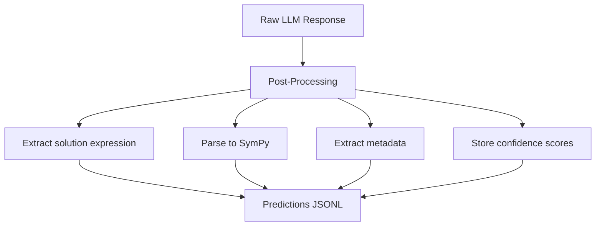
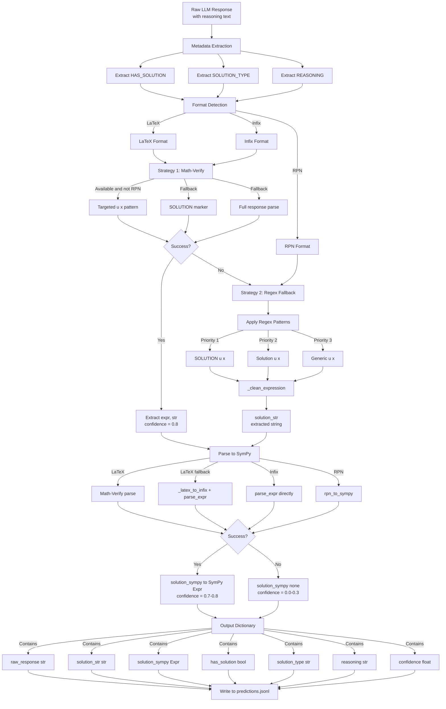
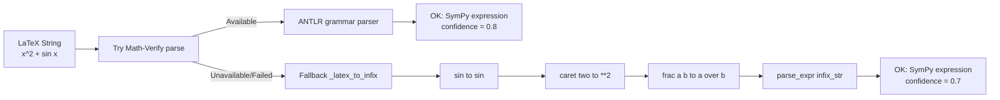
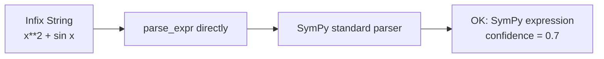
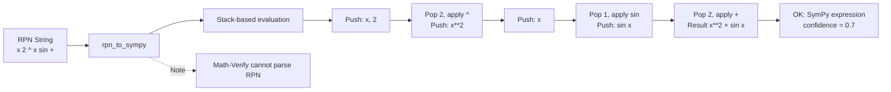

# Post-Processing Flow

This document covers how raw LLM responses are parsed into structured fields.

Related docs:
- [docs/EVALUATION_PIPELINE.md](docs/EVALUATION_PIPELINE.md)
- [docs/METRICS_REFERENCE.md](docs/METRICS_REFERENCE.md)

## Overview

The post-processing stage extracts solution text, parses SymPy expressions, and collects metadata.



---

## Complete Pipeline (All Formats)



---

## Format-Specific Processing

### LaTeX Format



### Infix Format



### RPN Format



---

## Location

- Main module: [src/llm/postprocess.py](src/llm/postprocess.py)
- Math-Verify adapter: [src/llm/math_verify_adapter.py](src/llm/math_verify_adapter.py)

## Function: parse_llm_output()

Extracts mathematical content from raw LLM response text.

```python
result = parse_llm_output(
    response="To solve...\nSOLUTION: u(x) = x**2 + sin(x)\n...",
    extract_solution=True,
    validate=True,
)
```

### Output Fields

| Field | Type | Source | Description |
|-------|------|--------|-------------|
| raw_response | str | Input | Untouched full LLM response with reasoning |
| solution_str | str | Extraction | Extracted solution expression (e.g., -x**2 + sin(x)) |
| solution_sympy | SymPy | Parsing | Canonicalized SymPy expression object |
| has_solution | bool or None | Regex | Whether solution exists (parsed from YES/NO) |
| solution_type | str or None | Regex | Solution classification (exact_symbolic, series, family, etc.) |
| confidence | float | Strategy | Confidence score (0.8 for Math-Verify, 0.7 for SymPy, 0.3 for errors) |
| reasoning | str or None | Extraction | Extracted reasoning steps (if present) |

---

## Solution Extraction Strategies

### Strategy 1: Math-Verify (Primary, LaTeX and Infix)

```python
from src.llm.math_verify_adapter import extract_solution_from_response

mv_result = extract_solution_from_response(response)
if mv_result is not None:
    sympy_expr, raw_str = mv_result
```

Multi-strategy approach (most-specific first):

1. Targeted u(x) = line
2. Structured SOLUTION marker
3. Full response parse

Confidence: 0.8

---

### Strategy 2: Regex Fallback (All Formats)

```python
patterns = [
    r"^SOLUTION\s*:\s*u\s*\(\s*x\s*\)\s*=\s*(.+?)(?:\n|$)",
    r"[Ss]olution[:\s]+u\s*\(\s*x\s*\)\s*=\s*(.+?)(?:\n|$)",
    r"u\s*\(\s*x\s*\)\s*=\s*(.+?)(?:\n|$|\.(?:\s|$))",
]
```

Cleaning steps:
- Trim whitespace and trailing periods
- Remove LaTeX delimiters ($...$, \(...\))
- Clean up reasoning fragments

Confidence: 0.7

---

### Strategy 3: RPN Support

RPN format: x 2 ^ x sin +

Process:
1. Regex extracts the RPN string
2. [src/data/formatters/rpn_formatter.py](src/data/formatters/rpn_formatter.py) converts RPN -> SymPy

Limitation: Math-Verify cannot parse RPN

```python
from src.data.formatters.rpn_formatter import rpn_to_sympy

sympy_expr = rpn_to_sympy("x 2 ^ x sin +")
```

---

## Expression Parsing

### LaTeX -> SymPy Conversion

Process ([src/llm/math_verify_adapter.py](src/llm/math_verify_adapter.py)):

```
LaTeX input: "x^{2} + \sin(x)"
    -> Math-Verify
    -> or custom _latex_to_infix
Infix form: "x**2 + sin(x)"
    -> parse_expr + transformations
SymPy: x**2 + sin(x)
```

Symbol dictionary (FREDHOLM_LOCAL_DICT):

```python
{
    "x": Symbol("x"),
    "t": Symbol("t"),
    "C": Symbol("C"),
    "c_1": Symbol("c_1"),
    "pi": sp.pi,
    "E": sp.E,
    "Integral": sp.Integral,
    "oo": sp.oo,
}
```

---

## Metadata Extraction

### has_solution Field

Extracted from YES/NO patterns in response.

Fallback logic:
- If HAS_SOLUTION missing and a solution was extracted -> infer True
- If HAS_SOLUTION missing and no solution found -> infer False

### solution_type Field

Classification of solution structure. Extracted from SOLUTION_TYPE marker:

| Type | Meaning | Example |
|------|---------|---------|
| exact_symbolic | Closed-form symbolic | u(x) = sin(x) |
| approx_coef | Approximate with coefficients | u(x) ~= a0 + a1*x + a2*x**2 |
| series | Truncated series | u(x) = term1 + term2 + term3 |
| family | Family of solutions (non-unique) | u(x) = C*sin(pi*x) |
| discrete_points | Solution at discrete points only | [(0.0, 1.2), (0.5, 2.4)] |
| regularized | Ill-posed, requires regularization | |
| none | No solution exists | |

---

## Confidence Scores

| Source | Score | Meaning |
|--------|-------|---------|
| Math-Verify extraction | 0.8 | Robust LaTeX parsing, high reliability |
| Regex + SymPy parsing | 0.7 | Successful extraction and validation |
| Fallback (errors ignored) | 0.3 | Partial parsing, validation failed |
| No extraction | 0.0 | Failed to extract any solution |

```python
if result["confidence"] >= 0.7:
    evaluate_solution(result)
else:
    logger.warning(f"Low confidence: {result['confidence']}")
```
