# Fred-LLM Pipeline Architecture

This document describes the modular pipeline for solving Fredholm integral equations using LLMs.

## Overview

The pipeline consists of 4 main modules that work together:

1. **Dataset Preparation** - Augment data and convert formats
2. **Prompt Engineering** - Design effective prompts for LLMs
3. **LLM Methods** - Model training and inference approaches
4. **Evaluation** - Assess solution quality

## Pipeline Diagram

```mermaid
%%{init: {'theme': 'neutral', 'themeVariables': { 'fontSize': '14px'}}}%%
flowchart LR
 subgraph Dataset_Preparation["Module 1: Dataset Preparation"]
    direction TB
    DP1["Data Augmentation"]
    DP1a(["Add no-solution"])
    DP1b(["Add special function"])
    DP1c(["Generate numeric ground truth"])
    DP2["Format Conversion"]
    DP2a(["To LaTeX"])
    DP2b(["To RPN"])
    DP2c(["Tokenize for LLM"])
    DP1 --> DP1a & DP1b & DP1c
    DP1 --> DP2
    DP2 --> DP2a & DP2b & DP2c
  end

 subgraph Prompt_Engineering["Module 2: Prompt Engineering"]
    direction TB
    PR1["Prompt Design"]
    PR1a(["Direct prompts"])
    PR1b(["Chain of thought"])
    PR1c(["Approximation prompts"])
    PR2["Output Format"]
    PR2a(["Symbolic"])
    PR2b(["Series"])
    PR2c(["Code format"])
    PR1 --> PR1a & PR1b & PR1c
    PR1 --> PR2
    PR2 --> PR2a & PR2b & PR2c
  end

 subgraph LLM_Methods["Module 3: LLM Methods"]
    direction TB
    LLM1["Fine Tuning"]
    LLM1a(["Supervised pairs"])
    LLM1b(["Use Phi or T5"])
    LLM2["In Context Learning"]
    LLM2a(["Few-shot examples"])
    LLM2b(["Chain of thought prompts"])
    LLM3["Tool Use"]
    LLM3a(["Generate Python"])
    LLM3b(["Use symbolic tools"])
    LLM1 --> LLM1a & LLM1b
    LLM1 --> LLM2
    LLM2 --> LLM2a & LLM2b
    LLM2 --> LLM3
    LLM3 --> LLM3a & LLM3b
  end

 subgraph Evaluation["Module 4: Evaluation"]
    direction TB
    EV1["Symbolic Eval"]
    EV1a(["Exact match"])
    EV1b(["BLEU / TeX BLEU"])
    EV2["Numeric Eval"]
    EV2a(["MAE / MSE"])
    EV2b(["Test points"])
    EV3["Robustness"]
    EV3a(["Prompt variation"])
    EV3b(["Unseen function types"])
    EV1 --> EV1a & EV1b
    EV1 --> EV2
    EV2 --> EV2a & EV2b
    EV2 --> EV3
    EV3 --> EV3a & EV3b
  end

    Dataset_Preparation --> Prompt_Engineering
    Prompt_Engineering --> LLM_Methods
    LLM_Methods --> Evaluation

     DP1:::submod
     DP1a:::step
     DP1b:::step
     DP1c:::step
     DP2:::submod
     DP2a:::step
     DP2b:::step
     DP2c:::step
     PR1:::submod
     PR1a:::step
     PR1b:::step
     PR1c:::step
     PR2:::submod
     PR2a:::step
     PR2b:::step
     PR2c:::step
     LLM1:::submod
     LLM1a:::step
     LLM1b:::step
     LLM2:::submod
     LLM2a:::step
     LLM2b:::step
     LLM3:::submod
     LLM3a:::step
     LLM3b:::step
     EV1:::submod
     EV1a:::step
     EV1b:::step
     EV2:::submod
     EV2a:::step
     EV2b:::step
     EV3:::submod
     EV3a:::step
     EV3b:::step
    classDef submod fill:#e3f2fd,stroke:#1976d2,stroke-width:1px,color:#0d47a1
    classDef step fill:#ffffff,stroke:#42a5f5,stroke-width:1px,color:#0d47a1
```



## Module Details

### Module 1: Dataset Preparation

**Purpose:** Prepare and augment the Fredholm integral equation dataset for training and evaluation.

| Component | Description | Implementation |
|-----------|-------------|----------------|
| **Data Augmentation** | Expand dataset with variations | `src/data/augmentation.py` |
| - Add no-solution cases | Include equations without closed-form solutions | Synthetic generation |
| - Add special functions | Include Bessel, Legendre, etc. | SymPy special functions |
| - Numeric ground truth | Generate numerical solutions for evaluation | SciPy integration |
| **Format Conversion** | Convert equations to different representations | `src/data/format_converter.py` |
| - To LaTeX | Standard mathematical notation | SymPy latex() |
| - To RPN | Reverse Polish Notation for parsing | Custom tokenizer |
| - Tokenize for LLM | Prepare for model input | Subword tokenization |

### Module 2: Prompt Engineering

**Purpose:** Design and optimize prompts for different LLM approaches.

| Component | Description | Implementation |
|-----------|-------------|----------------|
| **Prompt Design** | Create effective prompts | `src/llm/prompt_templates.py` |
| - Direct prompts | Simple question-answer format | `basic` style |
| - Chain of thought | Step-by-step reasoning | `chain-of-thought` style |
| - Approximation prompts | Guide to series/numeric solutions | `approximation` style |
| **Output Format** | Specify expected response format | Template configuration |
| - Symbolic | Closed-form expression | SymPy-parseable |
| - Series | Taylor/Fourier expansions | Coefficient lists |
| - Code format | Python code for solution | Executable snippets |

### Module 3: LLM Methods

**Purpose:** Apply different LLM techniques for equation solving.

| Component | Description | Implementation |
|-----------|-------------|----------------|
| **Fine Tuning** | Train models on equation pairs | Training scripts |
| - Supervised pairs | (equation, solution) datasets | HuggingFace Trainer |
| - Use Phi or T5 | Smaller, efficient models | Model selection |
| **In Context Learning** | Few-shot prompting | `src/llm/model_runner.py` |
| - Few-shot examples | Include solved examples | Example bank |
| - Chain of thought | Demonstrate reasoning steps | CoT templates |
| **Tool Use** | Enable symbolic computation | Tool-assisted mode |
| - Generate Python | LLM writes solver code | Code execution |
| - Use symbolic tools | SymPy/SciPy integration | Tool calling |

### Module 4: Evaluation

**Purpose:** Assess the quality and robustness of solutions.

| Component | Description | Implementation |
|-----------|-------------|----------------|
| **Symbolic Eval** | Compare symbolic expressions | `src/llm/evaluate.py` |
| - Exact match | SymPy simplification and comparison | `symbolic_equal()` |
| - BLEU / TeX BLEU | Token-level similarity | Text metrics |
| **Numeric Eval** | Compare numerical values | Numeric comparison |
| - MAE / MSE | Mean absolute/squared error | NumPy metrics |
| - Test points | Sample points comparison | Grid evaluation |
| **Robustness** | Test generalization | Robustness suite |
| - Prompt variation | Different prompt phrasings | Prompt bank |
| - Unseen function types | Novel kernel/function forms | Test split |

## Code Mapping

Each module maps to specific source files:

```
src/
├── data/                           # Module 1: Dataset Preparation
│   ├── augmentation.py             # Data augmentation
│   ├── format_converter.py         # LaTeX/RPN conversion
│   ├── loader.py                   # Data loading
│   └── validator.py                # Data validation
├── llm/                            # Modules 2 & 3: Prompting & LLM Methods
│   ├── prompt_templates.py         # Prompt engineering
│   ├── model_runner.py             # LLM inference
│   ├── postprocess.py              # Output parsing
│   └── evaluate.py                 # Module 4: Evaluation
└── utils/
    └── math_utils.py               # Numeric evaluation helpers
```

## Workflow Example

```python
from src.main import FredLLMPipeline
from src.config import load_config

# Load configuration
config = load_config("config.yaml")

# Initialize pipeline (all modules)
pipeline = FredLLMPipeline(config)

# Run full pipeline
# 1. Load & prepare data (Module 1)
# 2. Generate prompts (Module 2)
# 3. Run LLM inference (Module 3)
# 4. Evaluate results (Module 4)
results = pipeline.run()
```
